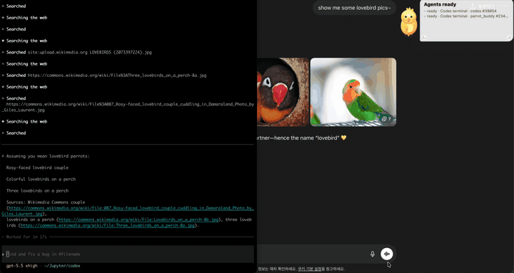

# Parrot Buddy

<p align="center">
  
</p>

Codex와 Claude Code가 지금 작업 중인지, 확인을 기다리는지, 끝났는지 메뉴바 앵무새와 작은 데스크톱 pet으로 보여주는 macOS 앱입니다. 앵무새를 길게 누르면 Codex CLI를 사용하는 개인비서 채팅도 열 수 있습니다.



---

## 한국어 가이드

### 1. 요구사항

- macOS
- Node.js 22 이상 권장
- npm
- Git
- 개인비서 기능 사용 시: 로그인된 `codex` CLI

Node.js가 없다면 먼저 설치하세요.

```bash
node --version
npm --version
```

개인비서 기능은 `.env` API 키를 쓰지 않고, 사용자의 Mac에 설치되어 로그인된 Codex CLI를 사용합니다.

```bash
codex --help
codex login
```

### 2. 설치

```bash
git clone https://github.com/Choah/parrot_buddy.git
cd parrot_buddy
npm install
npm run install:app
```

`npm run install:app`은 Finder와 Spotlight에서 열 수 있는 macOS 앱을 만듭니다.

기본 설치 위치:

```text
/Applications/Parrot Buddy.app
```

`/Applications`에 쓸 권한이 없으면 자동으로 아래 위치에 설치됩니다.

```text
~/Applications/Parrot Buddy.app
```

사용자 Applications 폴더에 강제로 설치하려면:

```bash
npm run install:app -- --user
```

### 3. 실행

설치 후 다음 중 하나로 실행하세요.

- Finder에서 `Applications > Parrot Buddy.app` 더블클릭
- Spotlight에서 `Parrot Buddy` 검색 후 실행
- 터미널에서 실행:

```bash
npm run launch
```

앱은 Dock에 뜨지 않고, macOS 상단 메뉴바에 작은 앵무새 아이콘으로 표시됩니다.

종료:

```bash
npm run stop
```

상태 확인:

```bash
curl http://127.0.0.1:17872/health
```

### 4. 처음 실행하면 보이는 것

- 흰색 외곽선은 실제 Parrot Buddy 창 크기입니다.
- **이 영역을 크게 만들면 뒤에 켜져 있는 앱이나 창 클릭을 막을 수 있습니다.**
- 그래서 앵무새와 작업 상태 창을 감싸는 최소 크기로 두는 것이 좋습니다.
- 흰색 외곽선 아래쪽 왼쪽의 `guide` 버튼을 누르면 앱 안에서 사용법을 볼 수 있습니다.
- 기본 compact 창은 앵무새와 작업 상태 창이 함께 보이는 크기로 시작합니다.
- 사용자가 위치와 크기를 바꾸면 로컬에 저장되지만, 새 설치자는 이 기본 배치로 시작합니다.

### 5. 조작법

- 앵무새 드래그: Parrot Buddy 창 전체 이동
- 앵무새 길게 누르기: 개인비서 채팅 열기
- 앵무새 클릭: 조이의 짧은 속생각을 4초간 랜덤 표시
- 흰색 외곽선이 보일 때 앵무새 말풍선 양옆 작은 핸들 드래그: 말풍선 폭 조절
- 흰색 외곽선이 보일 때 앵무새 오른쪽 아래 작은 손잡이 드래그: 앵무새 크기 조절. 현재 크기가 기본값입니다.
- Guide 제목 줄 드래그: guide가 열린 상태에서 창 전체 이동
- **앵무새 우클릭 또는 Option을 누른 채 앵무새 클릭: 흰색 외곽선 숨기기/다시 표시**
- 작업 상태 창 드래그: 작업 상태 창 위치 이동
- 작업 상태 창 왼쪽/오른쪽 아래 핸들: 작업 상태 창 크기 조정
- 작업 상태 창 오른쪽 위 `×`: 작업 상태 창 숨기기
- 작업 상태 창이 숨겨진 상태에서 앵무새 빠르게 3회 클릭: 작업 상태 창 다시 표시
- 외곽선 가장자리나 모서리 드래그: 실제 투명 창 크기 수동 조정
- Esc: guide 또는 창 크기 조정 모드 닫기

작업 상태 창을 옮기거나 크기를 조절하면 흰색 창 영역이 내용에 맞춰 자동으로 줄거나 늘어납니다.
`guide` 탭은 흰색 외곽선 아래쪽 왼쪽에 표시됩니다.

### 6. 개인비서 기능

앵무새를 길게 누르면 개인비서 채팅창이 열립니다. 조이 Assistant는 guide와 같은 큰 패널 크기로 열리고, 창 크기가 자동으로 맞춰집니다. 아래 모서리 핸들을 드래그하면 조이 Assistant 크기를 직접 조절할 수 있습니다. 개인비서 이름은 `조이`이고, 겉으로는 차갑지만 알고 보면 따뜻하고 착한 츤데레 앵무새입니다. 오늘 한 일, 앞으로 할 일, 일정, 기억해야 할 내용을 자연스럽게 적으면 Codex CLI가 내용을 정리하고 Parrot Buddy가 로컬 파일에 저장합니다.

앵무새를 한 번 클릭하면 조이가 주인님에 대해 떠올린 짧은 속생각을 보여줍니다. 이 속생각은 `memory.md`, 최근 history, 최근 assistant 세션을 참고해서 하루 단위로 30개 후보를 만듭니다. 앱이 켜질 때 자동으로 오늘 후보를 준비하고, 이후 주기적으로 날짜 변경과 메모리 변경을 확인해 갱신합니다. 클릭할 때마다 그중 하나를 랜덤으로 4초간 표시합니다.

장기 메모리는 OS cron이 아니라 앱 내부 백그라운드 정리 작업으로 관리합니다. 앱 시작 후 잠시 뒤, 이후 주기적으로 `memory.md`가 커졌거나 바뀌었는지 확인하고 Codex CLI로 중복/오래된 일회성 기록을 정리합니다. 교체 전에는 `memory-backups/`에 원본을 백업하고, 너무 짧거나 비정상적인 정리 결과는 적용하지 않습니다.

간단한 인사나 잡담은 저장하지 않습니다. 취향, 반복되는 정보, 일정, 약속, 결정, 나중에 챙길 일처럼 다시 쓸 가능성이 있는 것만 저장합니다.

저장 위치:

```text
~/.parrot-buddy/assistant/
```

주요 파일:

- `history/YYYY-MM-DD.md`: 날짜별 기록
- `history/latest.md`: 최신 날짜 기록
- `memory.md`: 오래 기억할 사용자 정보와 취향
- `memory-maintenance.json`: 장기 메모리 정리 상태
- `memory-backups/*.md`: 정리 전 메모리 백업
- `reminders.json`: 알림/일정
- `sessions/*.json`: 개인비서 처리 이력

예시:

```text
오늘 README 정리했고, 내일 오전에 dmg 릴리즈 확인해야 해.
```

명확한 날짜나 시간이 있으면 reminder로 저장됩니다. 날짜가 애매하면 바로 저장하지 않고 확인 질문을 합니다.

### 7. 메뉴바 사용

상단 메뉴바의 앵무새 아이콘을 클릭하면 현재 agent 상태와 메뉴가 보입니다.

- `Show Floating Bird`: 앵무새 창 보이기
- `Hide Bird`: 앵무새 창 숨기기
- `Agent Settings`: Codex/Claude Code 감시 연결 설정
- `Restart Agent Monitor`: Codex/Claude 감시 재시작
- `Quit`: 앱 완전 종료

Codex 또는 Claude Code가 작업 중이거나 확인을 기다리는 동안에는 메뉴바 아이콘이 흔들립니다.

Codex 또는 Claude Code를 쓰지 않는 사람은 `Agent Settings`에서 해당 감시를 끌 수 있습니다. 설정은 `~/.parrot-buddy/settings.json`에 저장되고, 저장하면 모니터가 즉시 재시작됩니다.

알림 기준:

- **각 터미널/세션에서 사용자 확인이 필요한 `confirm` 상태**가 되면 소리와 앵무새 또잉 알림이 납니다.
- **각 터미널/세션의 top-level Codex/Claude Code 작업이 끝난 순간** 알립니다.
- 작업이 끝나거나 확인이 필요하면 앵무새 말풍선에도 어떤 작업인지 짧게 표시합니다.
- 소리 구분: **작업 완료는 짹짹 2번**, **사용자 확인 필요는 짹 1번**입니다.
- 다른 독립 Codex/Claude Code 작업이 켜져 있어도, 해당 터미널/세션 작업 완료는 따로 알립니다.
- 개별 서브에이전트가 먼저 끝나는 경우에는 소리나 또잉 없이 상태만 조용히 갱신합니다.

### 8. 상태 의미

- `working`: Codex 또는 Claude Code가 작업 중
- `confirm`: 승인, 충돌 처리, 실행 허가 같은 사용자 확인을 기다림
- `ready`: 프로세스는 켜져 있고 대기 중
- `stopped`: 관련 프로세스나 live lock을 찾지 못함

### 9. 감시 대상

Codex:

```text
~/.codex/sessions/**/*.jsonl
Codex CLI processes
Codex VS Code app-server process
```

Claude Code:

```text
~/.claude/hooks/peon-ping/.state.json
~/.claude/projects/**/*.jsonl
~/.claude/transcripts/**/*.jsonl
Claude Code processes
Claude IDE lock files
```

대화 전문은 UI에 표시하지 않습니다. 상태 판단에 필요한 lifecycle event, timestamp, cwd, process 정보만 사용합니다.
다른 설치 경로를 쓰는 경우 `Agent Settings`에서 Codex sessions root, Claude projects/transcripts/lock 경로를 바꾸면 됩니다.

### 10. 문제 해결

앱이 이상하게 남아 있거나 실행이 안 되면:

```bash
npm run stop
npm run launch
```

앱 클릭 실행 로그:

```bash
cat /tmp/parrot-buddy-app-launch.log
cat /tmp/parrot-buddy.log
```

앱을 다시 설치:

```bash
npm run install:app
```

### 11. 개발

```bash
npm test
npm run build:icon
npm run start
npm run dist:mac
```

Optional shell helper는 별도 로컬 명령을 Parrot Buddy bridge에 직접 등록하고 싶을 때만 설치하세요.

```bash
npm run install:shell
npm run uninstall:shell
```

### 12. GitHub Release에 DMG 올리기

태그를 push하면 GitHub Actions가 macOS에서 `.dmg`와 `.zip`을 빌드해서 Release assets에 자동으로 첨부합니다.

```bash
git tag v0.1.0
git push origin v0.1.0
```

생성되는 파일:

```text
Parrot-Buddy-macOS-0.1.0-<arch>.dmg
Parrot-Buddy-macOS-0.1.0-<arch>.zip
```

로컬에서 먼저 확인하려면:

```bash
npm run dist:mac
```

빌드 결과는 `dist/`에 생기며 git에는 포함하지 않습니다.

---

## English Guide

### 1. Requirements

- macOS
- Node.js 22 or newer recommended
- npm
- Git
- Logged-in `codex` CLI for the personal assistant feature

Check your local Node.js installation:

```bash
node --version
npm --version
```

The personal assistant uses your local Codex CLI session instead of `.env` model API keys.

```bash
codex --help
codex login
```

### 2. Install

```bash
git clone https://github.com/Choah/parrot_buddy.git
cd parrot_buddy
npm install
npm run install:app
```

`npm run install:app` creates a macOS app bundle that can be opened from Finder or Spotlight.

Default install location:

```text
/Applications/Parrot Buddy.app
```

If `/Applications` is not writable, the installer falls back to:

```text
~/Applications/Parrot Buddy.app
```

To force user-level installation:

```bash
npm run install:app -- --user
```

### 3. Run

After installing, open the app in one of these ways:

- Double-click `Applications > Parrot Buddy.app` in Finder
- Search `Parrot Buddy` in Spotlight
- Start from the terminal:

```bash
npm run launch
```

The app does not appear in the Dock. It appears as a small parrot icon in the macOS menu bar.

Stop the app:

```bash
npm run stop
```

Check health:

```bash
curl http://127.0.0.1:17872/health
```

### 4. First Launch

- The white outline is the real Parrot Buddy window.
- **If this area is too large, it can block clicks to apps or windows behind it.**
- Keep it as small as possible around the parrot and work status window.
- Click the left `guide` tab to open the in-app guide.

### 5. Controls

- Drag the parrot: move the whole Parrot Buddy window
- Long-press the parrot: open the personal assistant chat
- When the white outline is visible, drag the small handle at the lower-right of the parrot: resize the parrot. The current size is the default.
- Drag the Guide title bar: move the whole window while the guide is open
- **Right-click the parrot or Option + click the parrot: hide/show the white outline**
- Drag the work status window: move only that window
- Drag the lower-left/lower-right handles on the work status window: resize it
- Click `×` on the work status window: hide it
- Triple-click the parrot quickly while the work status window is hidden: show it again
- Drag the white outline edges or corners: manually resize the transparent window
- Esc: close the guide or window resize mode

When you move or resize the work status window, the white window area automatically fits around the visible content.

### 6. Personal Assistant

Long-press the parrot to open the personal assistant chat. Joy Assistant opens at the same large panel size as the guide, and the app window adjusts automatically. Drag the lower corner handles to resize Joy Assistant directly. The assistant is named `Joy`: a cool-on-the-surface, secretly warm, kind tsundere parrot. Write today's notes, future tasks, schedule items, or reminders in natural language. Parrot Buddy calls your local logged-in Codex CLI, then stores the organized result in local files. Clicking the parrot shows one random Joy thought for four seconds. Joy thoughts are prepared automatically per day from local memory, recent history, and assistant sessions.

Simple greetings and obvious small talk are answered immediately in Joy's persona and are not saved. For other messages, Codex classifies the message as chat, recall, memory, schedule, task, or note in the same JSON response it uses to answer. Joy only saves reusable personal facts, preferences, plans, appointments, decisions, and follow-ups. If Codex marks a message as ordinary chat or recall, Parrot Buddy blocks history, memory, and reminder writes.

Long-term memory is maintained by an in-app background job, not an OS cron job. Shortly after startup and then periodically, Parrot Buddy checks whether `memory.md` is large or changed enough to compact. Codex CLI proposes a cleaned memory file, Parrot Buddy backs up the original in `memory-backups/`, and unsafe outputs that are too short are rejected.

You can drag the Joy Assistant by its header or empty panel area to move only that assistant window. Drag the parrot itself to move the whole floating window. Text input, buttons, message scroll, and reminder buttons remain clickable.

This feature does not use model API keys in `.env`.

Local storage:

```text
~/.parrot-buddy/assistant/
```

Important files:

- `history/YYYY-MM-DD.md`: daily notes
- `history/latest.md`: latest daily note
- `memory.md`: durable user memory and preferences
- `memory-maintenance.json`: memory cleanup status
- `memory-backups/*.md`: backups before memory cleanup
- `reminders.json`: reminders and schedule items
- `sessions/*.json`: assistant turn audit logs

### 7. Menu Bar

Click the menu bar parrot icon to see current agent status and actions.

- `Show Floating Bird`: show the floating parrot window
- `Hide Bird`: hide the floating parrot window
- `Agent Settings`: configure Codex/Claude Code monitoring
- `Restart Agent Monitor`: restart Codex/Claude monitoring
- `Quit`: quit the app

The menu bar icon wiggles while Codex or Claude Code is working or waiting for confirmation.

Users who do not use Codex or Claude Code can disable either connection in `Agent Settings`. Settings are saved to `~/.parrot-buddy/settings.json`, and saving restarts the monitor immediately.

Notification rules:

- It chirps and bounces when a terminal/session enters a `confirm` state that needs user attention.
- It alerts when a top-level Codex/Claude Code task finishes in that terminal/session.
- The parrot speech bubble also names the task that finished or needs attention.
- Sound cue: **task complete chirps twice**, while **user confirmation chirps once**.
- If another independent Codex/Claude Code task is still open, the finished terminal/session still alerts separately.
- Individual subagent completions update the status quietly without a chirp or bounce.

### 8. Status Meanings

- `working`: Codex or Claude Code is currently working
- `confirm`: user confirmation is needed, such as approval, conflict handling, or execution permission
- `ready`: the process is open and waiting
- `stopped`: no matching process or live lock was found

### 9. What It Watches

Codex:

```text
~/.codex/sessions/**/*.jsonl
Codex CLI processes
Codex VS Code app-server process
```

Claude Code:

```text
~/.claude/hooks/peon-ping/.state.json
~/.claude/projects/**/*.jsonl
~/.claude/transcripts/**/*.jsonl
Claude Code processes
Claude IDE lock files
```

Parrot Buddy does not display full conversation text. It only uses lifecycle events, timestamps, cwd, and process information needed to infer status.
If an agent uses a non-default install location, update the Codex sessions root or Claude projects/transcripts/lock paths in `Agent Settings`.

### 10. Troubleshooting

If the app is stuck or does not open:

```bash
npm run stop
npm run launch
```

Logs for app-click launch:

```bash
cat /tmp/parrot-buddy-app-launch.log
cat /tmp/parrot-buddy.log
```

Reinstall the app bundle:

```bash
npm run install:app
```

### 11. Development

```bash
npm test
npm run build:icon
npm run start
npm run dist:mac
```

Install optional shell helpers only if you want to manually report local command status to the Parrot Buddy bridge.

```bash
npm run install:shell
npm run uninstall:shell
```

### 12. GitHub Release DMG

Pushing a version tag triggers GitHub Actions to build `.dmg` and `.zip` files on macOS and attach them to the GitHub Release.

```bash
git tag v0.1.0
git push origin v0.1.0
```

Generated files:

```text
Parrot-Buddy-macOS-0.1.0-<arch>.dmg
Parrot-Buddy-macOS-0.1.0-<arch>.zip
```

To test the package locally first:

```bash
npm run dist:mac
```

The output is written to `dist/`, which is ignored by git.

---

## License

MIT License. See [LICENSE](./LICENSE).

---

## Sound Attribution

Completion chirp:

- Source: Wikimedia Commons, `File:Budgerigar chirping.ogg`
- URL: https://commons.wikimedia.org/wiki/File:Budgerigar_chirping.ogg
- Author: mary905
- License: Public domain

The original OGG is kept in `assets/budgerigar-chirp.ogg`; the app plays the converted CoreAudio file `assets/budgerigar-chirp.caf`.
